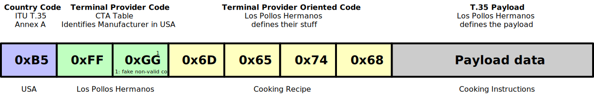

# T.35 Manufacturer Codes

### :warning: :warning: :warning: This is not an official document! :warning: :warning: :warning:

This repository can be used to collect ITU T.35 codes in one place. Feel free to submit pull requests and add more T.35 codes.

We can also collect commonly used T.35 codes and references to the payload definitions. E.g. HDR10+, DolbyVision, etc...

- [T.35 spec](https://www.itu.int/rec/T-REC-T.35/en).
- [ITU Operational Bulletin](https://www.itu.int/pub/T-SP-OB.1001-2012/en) where you can find the list of athorities responsible for registration.

Here is an illustrative example demonstrating the functionality of T.35. Additionally, you may refer to the accompanying [slide deck](./T35_explainer.pdf) for further information.

# North America

For North America CTA takes care of registering codes for USA and Canada. Please refer to [this page](https://www.cta.tech/about/t35-manufacturer-codes/) for an official verson of the data.

> Note: In the tables below all contact information was removed. The data is based on the table from [this PDF file](https://www.cta.tech/media/g5zfo0xk/manucode_7_november_2025.pdf) (7 November 2025).

- [t35_usa.csv](./data/t35_usa.csv)
- [t35_canada.csv](./data/t35_canada.csv)

# Germany

The table below is based on the table from [Bundesnetzagentur](https://www.bundesnetzagentur.de/DE/Fachthemen/Telekommunikation/Nummerierung/HKT/artikel.html?nn=697054).

- [t35_germany.csv](./data/t35_germany.csv)

# United Kingdom

TBD based on https://www.cix.co.uk/~bpechey/H221/

# Japan

CTA [lists](https://www.cta.tech/Resources/Standards/Manufacturer-Codes) a conact person for Japan but it seems that this person is not reachable anymore.
